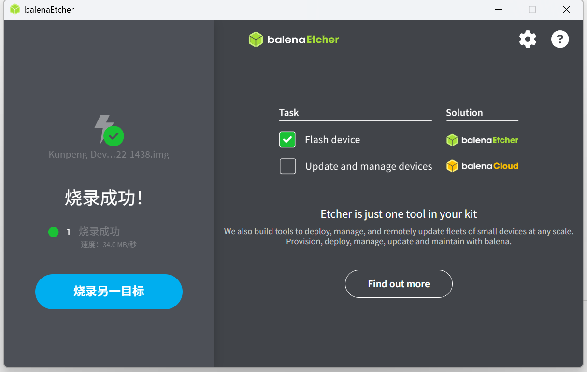
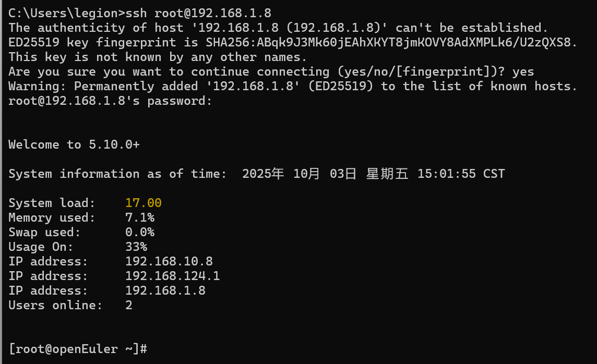

# 在 Orange Pi Kunpeng Pro 上烧录 openEuler 并启用 SSH 远程连接
本文演示如何在 Orange Pi Kunpeng Pro 开发板上：  
1. 使用 balenaEtcher 烧录官方 openEuler 镜像。  
2. 开启 SSH 远程登录，实现从宿主机直接连接管理。 
## 一、烧录 openEuler 镜像
**准备材料**
- 硬件：Kunpeng Pro 开发板、≥16GB TF/SD 卡、读卡器、电源适配器、网线（或 WiFi）、HDMI 显示器、键盘和鼠标  
- 软件：  
  - 官方 openEuler 镜像（.img 格式）  
  - [balenaEtcher](https://etcher.balena.io/) 烧录工具  

**下载并解压镜像**

从 Orange Pi 官方页面下载 Kunpeng Pro 对应的 openEuler 镜像。  

**烧录到 SD 卡**
打开 balenaEtcher， 点击 Flash from file，选择 openeuler-kunpeng.img，点击 Select target，选择 SD 卡。  
点击 Flash!，等待写入和校验完成。成功提示 Flash complete。



**首次启动**
将 SD 卡插入 Kunpeng Pro 卡槽。接上电源、HDMI、键盘、鼠标和网线，通电开机。  

默认账号密码为：
```
用户名：openEuler
密码：openEuler
```
## 二、SSH 远程登录 Kunpeng Pro
通过 SSH，可以在开发机上远程管理 Kunpeng Pro，而不用一直接显示器和键盘。

**确认板子 IP**

在 Kunpeng Pro 终端查看网卡信息：
```bash
ip a
```
查询到`wlan0` 的地址为 192.168.1.8。

**确认 SSH 服务**
```bash
systemctl status sshd
```
如果状态是 `active (running)` → 已经启用。
如果未启动，执行：
```bash
sudo dnf install -y openssh-server
sudo systemctl enable --now sshd
```

**在宿主机上登录**
```bash
ssh root@192.168.1.8
```



